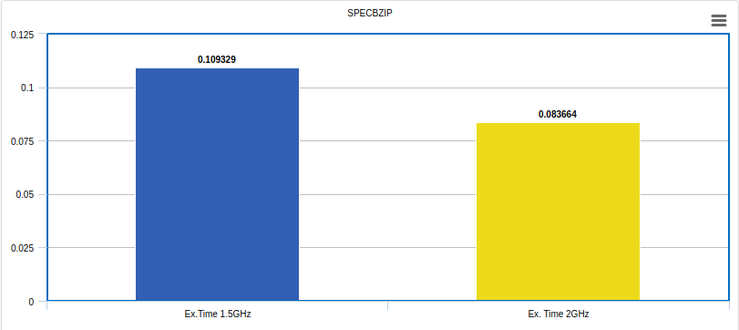
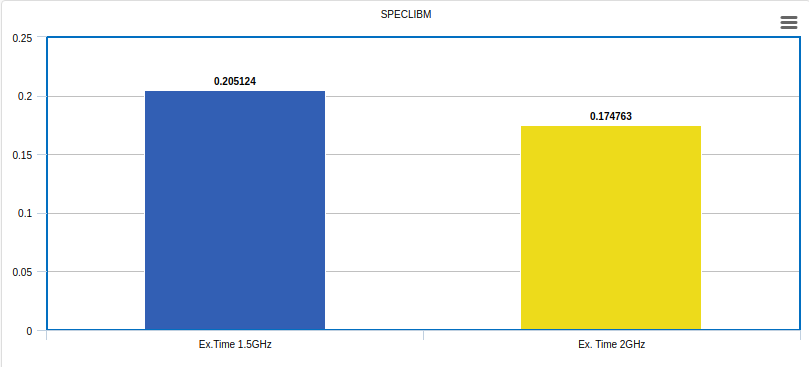
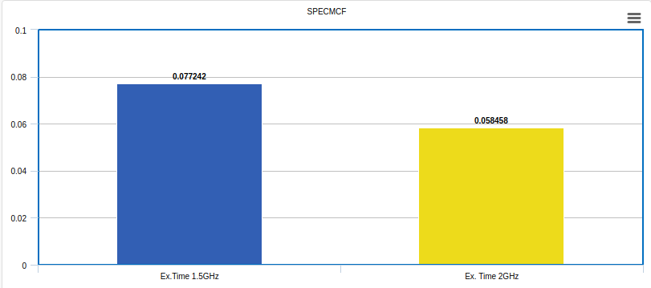
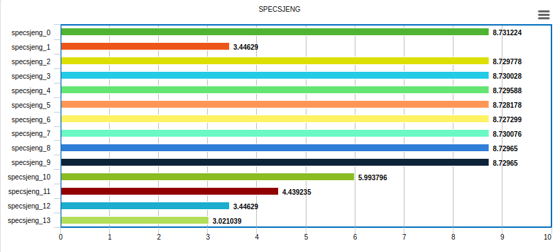
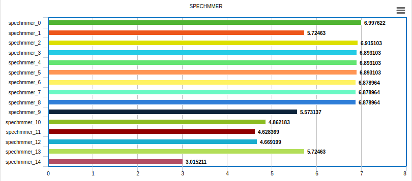
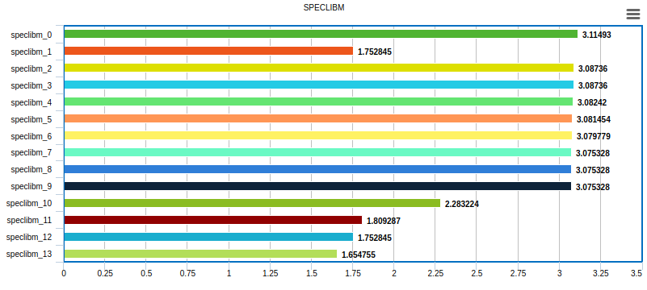
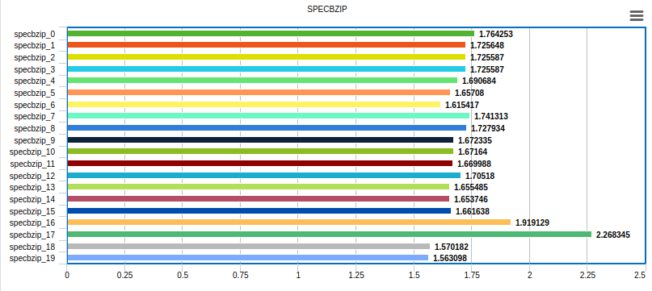
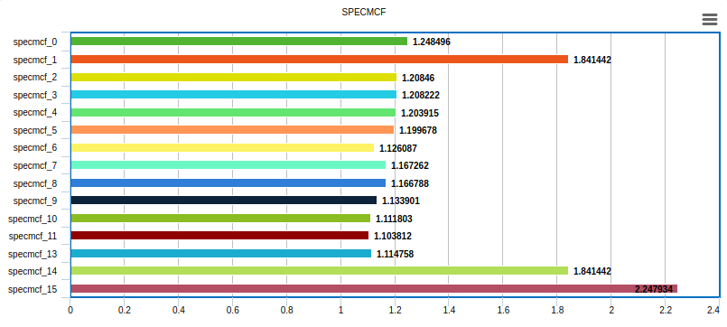
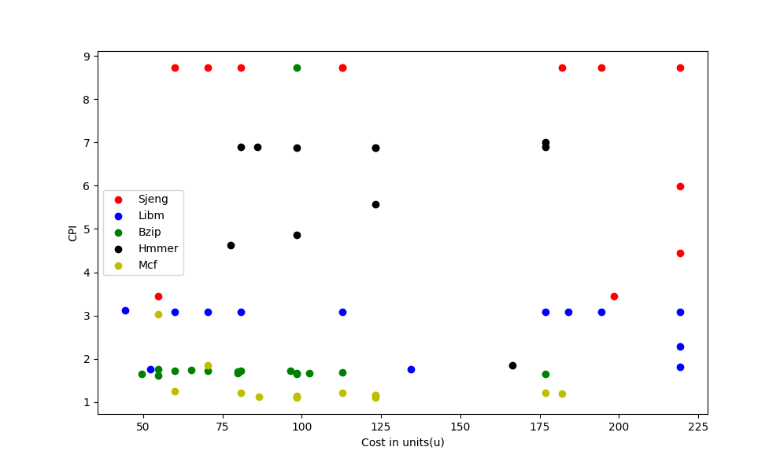

# Computer Architecture Lab 2

## Ομάδα 13
### Νένος Δημήτρης 9012 dimineno@ece.auth.gr
### Κουτζιαμπάσης Δημήτρης 8989 dkoutzia@ece.auth.gr

#### Βήμα 1
#### Ερώτημα 1

### Α.
Τα commited instruction είναι 100000000 όσα έχουμε πει να τρέξουν σε κάποια benchmarks είναι 100000001 
 
### B 
```ruby
system.cpu.icache.replacements                    335  
system.cpu.dcache.replacements                 681759                       # number of replacements
```
Το σύνολο των replacements είναι 682094.

###C
```ruby
system.l2.overall_accesses::total              683562                       # number of overall (read+write) accesses
```

#### Ερώτημα 2
Στο ερώτημα αυτό θα καταγράψουμε κάποια από τα βασικά αποτελέσματα των διαφορετικών benchmarks. Πιο συγκεκριμένα θα καταγράψουμε τον χρόνο εκτέλεσης, τα CPI καθώς και τα miss rates, τα οποία είναι και οι πιο σημαντικές μετρικές αξιολόγησης της απόδοσης ενός συστήματος.
Παρακάτω βλέπουμε τα αποτελέσματα stats.txt του εκάστοτε benchmark.
**SPECMCF**
```ruby
sim_seconds                                  0.058458                       # Number of seconds simulated
system.cpu.cpi                               1.169160                       # CPI: cycles per instruction
system.cpu.dcache.overall_miss_rate::total     0.002124                       # miss rate for overall accesses
system.cpu.icache.overall_miss_rate::total     0.004844                       # miss rate for overall accesses
system.l2.overall_miss_rate::total           0.209015                       # miss rate for overall accesses
```

**SPECBZIP**
```ruby
sim_seconds                                  0.083664                       # Number of seconds simulated
system.cpu.cpi                               1.673271                       # CPI: cycles per instruction
system.cpu.dcache.overall_miss_rate::total   0.014248                       # miss rate for overall accesses
system.cpu.icache.overall_miss_rate::total   0.000077                       # miss rate for overall accesses
system.l2.overall_miss_rate::total           0.295243                       # miss rate for overall accesses
```

**SPECLIBM**
```ruby
sim_seconds                                  0.174763                       # Number of seconds simulated
system.cpu.cpi                               3.495270                       # CPI: cycles per instruction
system.cpu.dcache.overall_miss_rate::total     0.060971                       # miss rate for overall accesses
system.cpu.icache.overall_miss_rate::total     0.000094                       # miss rate for overall accesses
system.l2.overall_miss_rate::total           0.999943                       # miss rate for overall accesses
```

**SPECHMMER**
```ruby
sim_seconds                                 0.000061                        # Number of seconds simulated
system.cpu.cpi                              8.020943                        # CPI: cycles per instruction
system.cpu.dcache.overall_miss_rate::total     0.055729                       # miss rate for overall accesses
system.cpu.icache.overall_miss_rate::total     0.095053                       # miss rate for overall accesses
system.l2.overall_miss_rate::total           0.937422                       # miss rate for overall accesses
```

**SPECSJENG**
```ruby
sim_seconds                                  0.513833                       # Number of seconds simulated
system.cpu.cpi                              10.276660                       # CPI: cycles per instruction
system.cpu.dcache.overall_miss_rate::total     0.121831                       # miss rate for overall accesses
system.cpu.icache.overall_miss_rate::total     0.000015                       # miss rate for overall accesses
system.l2.overall_miss_rate::total           0.999978                       # miss rate for overall accesses
```

Συνοπτικά,

|               | SPECMCF        | SPECBZIP       | SPECLIBM        | SPECHMMER       | SPECSJENG       |
| ------------- | -------------  | -------------  | -------------   | -------------   | -------------   |
| Execution Time| 0.058458       | 0.083664       | 0.174763        | 0.000061        | 0.513833        |
| CPI           | 1.169160       | 1.673271       | 3.495270        | 8.020943        | 10.276660       | 
|DCache Miss Rate| 0.002124      | 0.014248       | 0.060971        | 0.055729        | 0.121831        |
|ICache Miss Rate| 0.004844      | 0.000077       | 0.000094        | 0.095053        | 0.000015        | 
|L2Cache Miss Rate| 0.209015     | 0.295243       | 0.999943        | 0.937422        | 0.999978        |


####Ερώτημα 3
Στο ερώτημα αυό θα αλλάξουμε την συχνότητα χρονισμού του επεξεργαστή (**CPU**) για κάθε benchmark, έτσι ώστε να παρατηρήσουμε και να κατανοήσουμε τις επιπτώσεις που θα έχει αυτή η αλλαγή.


Ανοίγοντας, ενα οποιδήποτε stats.txt file απο τα 5 benchmarks μπορούμε να βρούμε σημαντικές πληροφορίες για τις τιμές των ρολογιών της CPU αλλά και του συστήματος. Οι πληροφορίες αυτές φαίνονται παρακάτω:


```ruby
..
system.clk_domain.clock                          1000                       # Clock period in ticks
..
system.cpu_clk_domain.clock                      667                       # Clock period in ticks
..
```
Το **system.clk_domain.clock** είναι η συχνότητα ρολογιού του **συστήματος** ενώ το **system.cpu_clk_domain.clock** είναι η συχνότητα ρολογιού της **CPU**.Η συχνότητα του συστήματος είναι **1GHz**, αφού η περίοδος είναι 1000 ticks (1 tick = 1 picosecond), δηλαδή είναι **1ns**,ενώ η συχνότητα της CPU είναι 667 ticks δηλαδή περίπου 1.5Ghz. Η συχνότητα ρολογιού της CPU χρονίζει όλα τα ψηφιακά συστήματα στο εσωτερικό του επεξεργαστή. Δηλαδή χρονίζει την ALU, την Control Unit καθώς και τις Level 1 και Level 2 Caches οι οποίες βρίσκονται στο εσωτερικό της CPU. Η συχνότητα του συστήματος χρονίζει τα περιφερειακά συστήματα και πιο συγκεκτριμένα στο μοντέλο _System-Call Emulation (SE)_, χρονίζει την μνήμη RAM (ή αλλιώς DRAM, αφου αποτελείτε κυρίως απο DRAM,σε αντίθεση με τις Caches οπου αποτελούνται απο SRAM). 

Για να επιβεβαιώσουμε αυτά που είπαμε παραπάνω μπορούμε να δούμε τα συγκεκριμένα αποτελέσματα του confings.ini.

```ruby
[system.clk_domain]
type=SrcClockDomain
clock=1000
domain_id=-1
eventq_index=0
init_perf_level=0
voltage_domain=system.voltage_domain
..
[system.cpu_clk_domain]
type=SrcClockDomain
clock=667
domain_id=-1
eventq_index=0
init_perf_level=0
voltage_domain=system.cpu_voltage_domain
..
[system.cpu]
clk_domain=system.cpu_clk_domain
..
[system.cpu.dcache]
clk_domain=system.cpu_clk_domain
..
[system.cpu.icache]
clk_domain=system.cpu_clk_domain
..
[system.dvfs_handler]
sys_clk_domain=system.clk_domain
..
[system.l2]
clk_domain=system.cpu_clk_domain
..
[system.mem_ctrls]
clk_domain=system.clk_domain
..
[system.mem_ctrls.dram]
clk_domain=system.clk_domain
..
[system.membus]
clk_domain=system.clk_domain
..
[system.tol2bus]
clk_domain=system.cpu_clk_domain
..
```

Όπως βλεπουμε και από το config.ini, αυτά τα οποία είπαμε παραπάνω επιβεβαιώνονται καθώς τα dcache, icache, l2cache, cpu χρονίζονται με **system.cpu_clk_domain** το οποίο είναι η συχνότητα CPU, ενώ η DRAM χρονίζεται με το **system.clk_domain**, δηλαδή την συχνότητα του συστήματος.


Αν προσθέσουμε άλλον έναν επεξεργαστή, η συχνότητα χρονισμού του θα είναι η συχνότητα της **CPU (CPU Frequency)**. Στην πραγματικότητα όμως δεν είναι απαραίτητο όλοι οι processors ενός συστήματος να τρέχουν στην ίδια συχνότητα, καθώς υπάρχουν και πολυπύρηνοι επεξεργαστές, όπως οι **big.LITTLE** της ARM που έχουν δυο είδη επεξεργαστών, εναν _LITTLE processor_ ο οποίος είναι σχεδιασμένος για power efficiency και τρέχει σε μικρότερες συχνότητες και εναν _big processor_ ο οποίος τρέχει σε μεγαλύτερες συχνότητες και είναι σχεδιασμένος για υψηλά υπολογιστικά φορτία.


Ας πάμε λοιπόν να συγκρίνουμε τα αποτελέσματα του προηγούμενου ερωτήματος που έγιναν με **2GHz** CPU Frequency, με αυτά που έτρεξαν με **1.5GHz** CPU Frequency.

Συνοπτικά, τα αποτελέσματα των προσομοιώσεων με **1.5GHz** είναι ως εξης:

|               | SPECMCF        | SPECBZIP       | SPECLIBM        | SPECHMMER       | SPECSJENG       |
| ------------- | -------------  | -------------  | -------------   | -------------   | -------------   |
| Execution Time| 0.077242       | 0.109329       | 0.205124        | 0.000070        |  0.582132       |
| CPI           | 1.158048       | 1.639115       | 3.075328        | 6.903211        | 8.727611        |
|DCache Miss Rate| 0.002124      | 0.014231       | 0.060971        | 0.055545        | 0.121831        | 
|ICache Miss Rate| 0.004844      | 0.000076       | 0.000094        | 0.095085        | 0.000015        |
|L2Cache Miss Rate| 0.209015     | 0.295246       | 0.999943        | 0.937422        | 0.999978        |











Όπως είναι λογικό, η μείωση της συχνότητας του ρολογιού έχει ως αποτέλεσμα την αύξηση του χρόνου εκτέλεσης.

| **Scaling**   | 1.5GHz CPU Clock | 2GHz CPU Clock |
| ------------- | -------------    | -------------  |
| SPECMCF       | 1.5              | 1.98           |
| SPECBZIG      | 1.5              | 1.96           |
| SPECLIBM      | 1.5              | 1.76           |
| SPECHMMER     | 1.5              | 1.72           |
| SPECSJENG     | 1.5              | 1.69           |


Φαίνεται ότι κάποια από τα benchmarks έχουν σχεδόν τέλειο scaling αλλά κάποια άλλα, όπως τα speclibm, spechmmer και specsjeng δεν έχουν τέλειο scaling. Αυτό συμβαίνει διότι τα συγκεκριμένα benchmark έχουν αρκετά μεγάλο **Level 2 Cache Miss Rate**, συνεπώς γίνονται αρκετές προσπελάσεις στην DRAM η οποία χρονίζεται με το ρολόι του συστήματος, το οποίο και δεν αλλάξαμε καθόλου. Αντίθετα, τα άλλα δυο benchmark έχουν σχεδόν τέλειο scaling, διότι τα DRAM overall accesses είναι αισθητά λιγότερα


###Βήμα 2ο
Αρχικά, ας πούμε λίγα λόγια για την εκτέλεση του κάθε benchmark με τις default τιμές και για CPU Frequency **1.5GHz**. Δηλαδή, για τα αποτελέσματα του πιο πάνω πίνακα.


#### SPECSJENG

Είναι το πιο αργό από τα 5 benchmark καθώς έχει **CPI = 8.72** και χρόνο εκτέλεσης **Ex. Time = 0.58** (για **commited instructions = 100000000**). Αυτό οφείλεται στο γεγονός ότι έχει 12.18% Data Cache Miss Rate καθώς και ότι κάνει πάρα πολλές φορές access την Level 2 Cache, λόγω του ότι έχει πάρα πολλά δεδομένα. `system.l2.overall_accesses::total              5264008 ` Ένας τρόπος με τον οποίο αντιμετωπίσαμε παρακάτω το υψηλό αυτό **CPI** είναι η εκμετάλευση του **locality** της μνήμης. Δηλαδή, αυξήσαμε το  **Cache Block Size**.


#### SPECHMMER

Το συγκεκριμένο benchmark έχει **CPI=6.9** και αυτό οφείλεται στο σχετικά υψηλό **Data Cache Miss Rate** που είναι **5.57%** καθώς και το **Instruction Cache Miss Rate** που είναι **9.5%** Εδώ βλέπουμε και τα συνολικά misses.
`system.cpu.icache.overall_misses::total           563`
`system.cpu.dcache.overall_misses::total           303`
Έπειτα από αρκετές προσομοιώσεις με διαφορετικές παραμέτρους παρατηρήθηκε ότι τόσο η αύξηση μεγέθους των Caches όσο και η αύξηση του Associativity δεν είχαν ιδιέταιρο impact στην απόδοση του benchmarck. Αυτό το οποίο επηρέασε αρκετά την απόδοση του, όπως και πριν, ήταν η εκμετάλλευση του χωρικού **locality**, δηλαδή η αύξηση της γραμμής της Cache. 


#### SPECLIBM

Το συσγκεκριμένο benchmark έχει **CPI=3.075**. Τα Miss Rates της Instruction Cache είναι αρκετά ικανοποιητικό, ενώ το Data Cache Miss Rate είναι **6.09%**, συνεπώς είναι ένας βασικός παράγοντας του υψηλού CPI. Ένας όμως ακόμα μεγαλύτερος παράγοντας είναι το το υψηλό Miss Rate της Level 2 Cache, το οποίο είναι **99.99%**. Εδω βλεπουμε και τα συνολικά accesses. `system.cpu.dcache.demand_accesses::total     48795210 ` `system.cpu.dcache.overall_misses::total       2975120` `system.cpu.icache.overall_accesses::total      6046640` `system.cpu.icache.overall_miss_latency::total     44555600` `system.l2.overall_accesses::total        1488197` `system.l2.overall_misses::total               1488112`. ΄Οπως και στα προηγούμενα benchmark, ο τρόπος με τον οποίο θα προσπαθήσουμε να μειώσουμε το CPI είναι με το να εκμετελευτούμε την χωρική τοπικότητα.


#### SPECBZIP

Το συγκεκριμένο benchmark έχει σχετικά καλό CPI και αυτό φαίνεται και από το γεγονός ότι έχει αρκετά καλά Miss Rates για τις Level 1 και Level 2 Caches. Παρ' όλα αυτά η Level 2 Cache έχει αξιοσημείωτο Miss Rate το οποίο θα προσπαθήσουμε και να βελτιώσουμε. `system.l2.demand_accesses::total               683661` `system.l2.overall_misses::total                201843`. Επίσης αυτό το οποίο θα παρατηρήσουμε με τις προσωμοιώσεις είναι ότι το locality στο συγκεκριμένο benchmark δεν έχει και τόσο μεγάλο impact όσο είχε στα προηγούμενα benchmarks. Αυτό ίσως οφείλεται στο ότι τα δεδομένα τα οποία χρησιμοποιεί το πρόγραμμα σε κάποια δεδομένη στιγμή δεν είναι δίπλα. Αυτο το οποίο θα κάνουμε είναι να αυξήσουμε το μέγεθος και το associetivity των caches ώστε να μειώσουμε τα misses ακόμα περισσότερο και να αυξήσουμε την απόδοση του benchmark.


#### SPECMCF

Αυτό το benchmark είναι το καλύτερο απ' όλα και αυτό φαίνεται από το πολύ μικρό CPI το οποίο έχει. Συγκεριμένα έχει **CPI=1.15**. Αυτό είναι λογικό καθώς τα miss rates των caches είναι αρκετά μικρά. `system.l2.overall_accesses::total              190604` `system.l2.overall_misses::total                 39839` `system.cpu.dcache.overall_accesses::total     35657862` `system.cpu.dcache.overall_misses::total         75748` `system.cpu.icache.overall_accesses::total     27762408` `system.cpu.icache.overall_misses::total        134488`. Η βελτίωση του CPI είναι αρκετά δύσκολη, αλλά θα επιτευχθεί με την αύξηση των associetivity καθώς και τα μεγέθη των caches.


Στο παρακάτω διάγραμμα παρατηρούμε στον κατακόρυφο άξονα το CPI και στον οριζόντιο άξονα από τις προσομοιώσεις που έγιναν. Οι παράμετροι των προσομοιώσεων αυτών φαίνονται στον παρακάτω πίνακα. Αυτό το οποίο μπορόυμε να παρατηρήσουμε είναι η μεγάλη συνεισφορά που έχει η **χωρική τοπικότητα**, καθώς βλεπουμε ότι αυξάνοντας το Cache Line Size μειώνεται και το CPI. Ενω επίσης παρατηρούμε ότι τόσο το Cache Size όσο και το associativity έχουν αρκετά μικρό impact στην απόδοση του benchmark


#### SPECSJENG

|               | l1d_size        | l1i_size       | l2_size        | l1i_assoc       | l1d_assoc       | l2_assoc     | cacheline_size  | cpi    |
| ------------- | -------------  | -------------  | -------------   | -------------   | -------------   | -------------   | -------------  | ------------- |
|specsjeng_0	 | 32kB       | 64kB       |512kB         | 1       | 1       | 2       | 64        |8.731224        |
|specsjeng_1	| 64kB       | 64kB      | 512kB          | 1       |  1       | 2       | 64        |3.446290	 |
|specsjeng_2	| 128kB      | 64kB       |512kB        | 1        | 1      | 2       | 64        | 8.729778	|
|specsjeng_3	| 128kB      | 128kB       | 512kB       | 1        | 1       | 2      | 64        | 8.730028	| 
|specsjeng_4	| 128kB     | 128kB       | 1024kB         | 1        | 1       | 2       | 64        | 8.729588	|
|specsjeng_5	 | 128kB       | 128kB       | 2048kB       | 1       | 1       | 2       | 64        |8.728178	 |
|specsjeng_6	 | 128kB       | 128kB       | 2048kB        | 2       | 2       | 2       | 64        |8.727299	|
|specsjeng_7	 | 128kB      | 128kB       | 512kB        | 4        | 4       | 4       | 64        |8.730076	|
|specsjeng_8	 | 128kB      |128kB       | 512kB        | 8       | 8       | 8       | 64        |8.729650	 | 
|specsjeng_9	 | 128kB     | 128kB      | 512kB         | 8       | 8       | 8       | 64        | 8.729650	|
|specsjeng_10	 | 128kB       |128kB       | 512kB        |  4       | 4       | 4       | 128        |5.993796	 |
|specsjeng_11	 | 128kB       | 128kB       | 512kB        | 4       | 4       | 4       | 256        |4.439235	 |
|specsjeng_12	 | 32kB      | 64kB       | 512kB         |  1      |  1     |  2     | 512        |3.446290	 |
|specsjeng_13	 | 32kB      | 64kB       | 512kB         |  1      |  1     |  2     | 1024        |3.021039| 




#### SPECHMMER


Εδω βλέπουμε πάλι ότι η αύξηση της μνήμης καθώς και το associativity δεν έχουν τόσο μεγάλο impact στην απόδοση του benchmark. Αντίθετα, η εκμετάλλευση της τοπικότητας με την αύξηση του cache line size βελτιώνει την απόδοση, αλλά όχι και τόσο πολύ

|               | l1d_size        | l1i_size       | l2_size        | l1i_assoc       | l1d_assoc       | l2_assoc     | cacheline_size  | cpi    |
| ------------- | -------------  | -------------  | -------------   | -------------   | -------------   | -------------   | -------------  | ------------- |
|spechmmer_0 	 | 32kB       | 64kB       |2048kB         | 1       | 1       | 2       | 64      |6.997622	        |
|spechmmer_1 	| 64kB       | 64kB      | 2048kB          | 1       |  1       | 2       | 64        |5.724630	 |
|spechmmer_2 	| 128kB      | 64kB       |2048kB        | 1        | 1      | 2       | 64        | 6.915103	|
|spechmmer_3 	| 128kB      | 128kB       |2048kB       | 1        | 1       | 2      | 64        | 6.893103	| 
|spechmmer_4 	| 128kB     | 128kB       | 1024kB         | 1        | 1       | 2       | 64        | 6.893103	|
|spechmmer_5 	 | 128kB       | 128kB       | 512kB       | 1       | 1       | 2       | 64        |6.893103	|
|spechmmer_6 	 | 128kB       | 128kB       | 512kB        | 2       | 2       | 2       | 64        |6.878964	|
|spechmmer_7 	 | 128kB      | 128kB       | 512kB        | 4        | 4       | 4       | 64        |6.878964	|
|spechmmer_8 	 | 128kB      |128kB       | 512kB        | 8       | 8       | 8       | 64        |6.878964	| 
|spechmmer_9 	 | 128kB     | 128kB      | 512kB         | 8       | 8       | 8       | 128        |5.573137	|
|spechmmer_10 	 | 128kB       |128kB       | 512kB        |  8       | 8       | 8       | 256        |4.862183	|
|spechmmer_11	 | 128kB       | 128kB       | 512kB        | 4       | 4       | 4       | 512        |4.628369	 |
|spechmmer_12	 | 64kΒ      | 64kB       | 512kB         |  4      |  4     |  4     | 512        |4.669199	 |
|spechmmer_13	 | 32kΒ      | 64kB       | 512kB         |  1      |  1     |  2     | 1024        |5.724630	 |
|spechmmer_14	 | 32kΒ      | 64kB       | 512kB         |  1      |  1     |  2     | 1024        |3.015211	 |




#### SPECLIBM.

Στην συνέχεια βλέπουμε κάποια από τα αποτελέσματα τα οποία βγάλαμε μετά από διάφορες προσοσμοιώσεις. Αυτό που μπορούμε να παρατηρήσουμε είναι την μεγάλη βελτίωση λόγω της αύξησης της χωρικής τοπικότητας με την αύξηση του cashe line size.

|               | l1d_size        | l1i_size       | l2_size        | l1i_assoc       | l1d_assoc       | l2_assoc     | cacheline_size  | cpi    |
| ------------- | -------------  | -------------  | -------------   | -------------   | -------------   | -------------   | -------------  | ------------- |
|speclibm_0 	 | 16kB       | 16kB       |512kB         | 1       | 1       | 2       | 64        |3.114930	|
|speclibm_1  	 | 16kB       | 64kB      | 512kB          | 1       |  1       | 2       | 64        |1.752845	 |
|speclibm_2  	 | 64kB      | 64kB       |512kB        | 1        | 1      | 2       | 64        | 3.087360	|
|speclibm_3 	 | 64kB      | 128kB       |512kB       | 1        | 1       | 2      | 64        | 3.087360	| 
|speclibm_4 	 | 128kB     | 128kB       | 512kB         | 1        | 1       | 2       | 64        | 3.082420	|
|speclibm_5 	 | 128kB       | 128kB       | 1024kB       | 1       | 1       | 2       | 64        |3.081454		|
|speclibm_6 	 | 128kB       | 128kB       | 2048kB        | 1       | 1       | 2       | 64        |3.079779	|
|speclibm_7 	 | 128kB      | 128kB       | 2048kB        | 2        | 2       | 4       | 64        |3.075328	|
|speclibm_8 	 | 128kB      |128kB       | 2048kB        | 4       | 4       | 4       | 64        |3.075328		| 
|speclibm_9 	 | 128kB     | 128kB      | 2048kB         | 8       | 4       | 8       | 64        |3.075328	|
|speclibm_10 	 | 128kB       |128kB       | 2048kB        |  8       | 8       | 8       | 128        |2.283224	|
|speclibm_11     | 128kB       | 128kB       | 2048kB        | 8       | 8       | 8       | 256        |1.809287	|
|speclibm_12     | 64kΒ      | 64kB       | 1024kB         |  8      |  8     |  8     | 256        |1.752845	|
|speclibm_13     | 128kB       | 128kB       | 4ΜΒ        | 4       | 4       | 4       | 2048        |1.654755	|




#### SPECBZIP.

Το συγκεκριμένο benchmarck, σε αντίθεση με τα προηγούμενα δεν επηρεάζεται σε μεγάλο βαθμό από την τοπικότητα της μνήμης, αλλά επηρεάζεται αρκετά από την μείωση των miss rates μέσω της αύξησης του μεγέθους των Caches αλλά και των associetivity τους. Παρ' όλα αυτά, το συγκεκριμένο μοντέλο είναι ήδη αρκετά αποδοτικό συνεπώς οι αλλαγές που κάναμε είχαν ως αποτέλεσμα μικρές βελτιστοποιήσεις σε σχέση με τα προηγούμενα benchmarks.

|               | l1d_size        | l1i_size       | l2_size        | l1i_assoc       | l1d_assoc       | l2_assoc     | cacheline_size  | cpi    |
| ------------- | -------------  | -------------  | -------------   | -------------   | -------------   | -------------   | -------------  | ------------- |
|specbzip_0	 	 | 32kB       | 32kB       |512kB         | 1       | 1       | 2       | 64        |1.764253		        |
|specbzip_1	 	| 64kB       | 32kB      | 512kB          | 1       |  1       | 2       | 64        |1.725648		 |
|specbzip_2	 	| 64kB      | 64kB       |512kB        | 1        | 1      | 2       | 64        | 1.725587		|
|specbzip_3	 	| 64kB      | 128kB       |512kB       | 1        | 1       | 2      | 64        |1.725587		| 
|specbzip_4	 	| 128kB     | 128kB       | 512kB         | 1        | 1       | 2       | 64        | 1.690684	|
|specbzip_5	 	 | 128kB       | 128kB       | 1024kB       | 1       | 1       | 2       | 64        |1.657080	|
|specbzip_6	 	 | 128kB       | 128kB       | 2048kB        | 1       | 2       | 2       | 64        |1.615417	|
|specbzip_7	 	 | 32kB      | 32kB       | 512kB        | 2        | 2       | 2       | 64        |1.741313	|
|specbzip_8	 	 | 32kB      |32kB       | 512kB        | 4       | 4       | 2       | 64        |1.727934		| 
|specbzip_9	 	 | 128kB     | 128kB      | 512kB         | 4       | 4       | 2       | 64        |1.672335	|
|specbzip_10 	 | 128kB       |128kB       | 512kB        |  4       | 4       | 4       | 64        |1.671640	|
|specbzip_11	 | 128kB       | 128kB       | 512kB        | 4       | 4       | 8       | 64        |1.669988	|
|specbzip_12	 | 128kB      | 128kB       | 512kB         |  1      |  1     |  1     | 64        |1.705180	|
|specbzip_13	 | 128kB      | 128kB       | 512kB         |  1      |  1     |  1     | 128        |1.655485	|
|specbzip_14 	 | 128kB      |128kB       | 512kB        | 4       | 4       | 4       | 128        |1.653746	| 
|specbzip_15 	 | 128kB     | 128kB      | 512kB         | 4       | 4       | 4       | 256        |1.661638	|
|specbzip_16 	 | 32kB       |32kB       | 512kB        |  1       | 1       | 2       | 512        |1.919129	|
|specbzip_17	 | 32kB       | 32kB       | 512kB        | 1       | 1       | 2       | 1024        |2.268345	|
|specbzip_18	 | 128kB      | 128kB       | 4MB         |  16      |  16     |  8     | 128        |1.570182	 |
|specbzip_19	 | 128kB      | 128kB       | 4MB         |  16      |  16     |  8     | 256        |1.563098	 |




#### SPECMCF.

To benchmark αυτό είναι ήδη αρκετά αποδοτικό, συπεπώς ήταν αρκετά δύσκολο το να το βελτιστοποιήσουμε αρκετά. Ο τρόπος όμως με τον οποίον μπορέσαμε να το βελτιώσουμε ήταν με το να μειώσουμε τα Cache Miss Rates, με το να αυξήσουμε το μέγεθος των caches και το associetivity του. Επίσης, όπως και στο προηγούμενο benchmark, το SPECMCF δεν επηρεάζεται από την τοπικότητα της μνήμης, συνεπώς η αύξηση των cache line sizes δεν βελτιώνει αισθητά την απόδοση του benchmark αυτού.

|               | l1d_size        | l1i_size       | l2_size        | l1i_assoc       | l1d_assoc       | l2_assoc     | cacheline_size  | cpi    |
| ------------- | -------------  | -------------  | -------------   | -------------   | -------------   | -------------   | -------------  | ------------- |
|specmcf_0	 	 | 32kB       | 64kB       |512kB         | 1       | 1       | 2       | 64        |1.248496			        |
|specmcf_1	 	 | 64kB       | 64kB      | 512kB          | 1       |  1       | 2       | 64        |1.841442	 |
|specmcf_2	 	 | 128kB      | 64kB       |512kB        | 1        | 1      | 2       | 64        | 1.208460	|
|specmcf_3	 	 | 128kB      | 128kB       |512kB       | 1        | 1       | 2      | 64        |1.208222	| 
|specmcf_4	 	 | 128kB     | 128kB       | 1024kB         | 1        | 1       | 2       | 64        |1.203915	|
|specmcf_5	 	 | 128kB       | 128kB       | 2048kB       | 1       | 1       | 2       | 64        |1.199678	|
|specmcf_6	 	 | 128kB       | 128kB       | 2048kB        | 2       | 2       | 2       | 64        |1.126087	|
|specmcf_7	 	 | 32kB      | 32kB       | 512kB        | 4        | 4       | 4       | 64        |1.167262	|
|specmcf_8	 	 | 32kB      |32kB       | 512kB        | 8       | 8       | 8       | 64        |1.166788	| 
|specmcf_9	 	 | 128kB     | 128kB      | 512kB         | 8       | 8       | 8       | 64        |1.133901	|
|specmcf_10 	 | 128kB       |128kB       | 512kB        |  4       | 4       | 4       | 128        |1.111803	|
|specmcf_11	     | 128kB       | 128kB       | 512kB        | 4       | 4       | 4       | 256        |1.103812	|
|specmcf_12	     | 128kB      | 128kB       | 512kB         | 8      |  8     |  8     | 256        | NAN	|
|specmcf_13 	 | 64kB      | 64kB       | 256kB         |  8      |  8     |  8     | 256        |1.114758	|
|specmcf_14 	 | 32kB      |32kB       | 512kB        | 1       | 1       | 2       | 512        |1.841442	| 
|specmcf_15 	 | 32kB     | 32kB      | 512kB         | 1       | 1       | 2       | 1024        |2.247934	|





Πίνακας αποτελεσμάτων για κάθε benchmark με τις βέλτιστες παραμέτρους απο τα simulations που τρέξαμε:

|               | l1d_size        | l1i_size       | l2_size        | l1i_assoc       | l1d_assoc       | l2_assoc     | cacheline_size  | cpi    |
| ------------- | -------------  | -------------  | -------------   | -------------   | -------------   | -------------   | -------------  | ------------- |
| specsjeng     | 32kB           |  64kB           |  512kB           |  1               |   1              |  2               | 1024           | 3.021039 |
| spechmmer     | 32kB	         |64kB	           |512kB		      |  1               |1                 |  2                | 1024           | 3.015211 |
| speclibm      | 128kB          | 128kB           |  4MB             | 4              | 4                | 4                | 2048          | 1.654755 |
| specbzig      | 128kB          | 128kb           | 4MB              | 16               | 16               | 8                 | 256           | 1.563098 |
| specmcf       | 128kB           | 128kB            | 512kB            | 4                | 4                | 4                 | 128           | 1.103812 |


#### Ερώτημα 3

Στο βήμα αυτό καλούμαστε να ανατρέξουμε στην βιβλιογραφία και να δημιουργήσουμε μια συνάρτηση κόστους έτσι ώστε να αξιολογήσουμε το της **"value for performance"** της κάθε σχεδιαστικής λύσης μας.

Αρχικά, αυτό το οποίο λάβαμε υπόψην μας είναι ότι το κόστος της Level 1 Cache είναι αρκετά μεγαλύτερο από το κόστος της Level 2 Cache η οποία έχει τουλάχιστον 10 φορές μεγαλύτερο latency. Στην συνέχεια, αυτά τα οποία λάβαμε υπόψην μας ήταν το μέγεθος της cahce καθώς και το associetivity αυτής. Όσον αφορά το μέγεθος, ορίσαμε ότι ο διπλασιασμός του μεγέθους της cache έχει ως συνέπεια τον διπλασιασμό του κόστους καθώς θα χρειαστεί ο διπλάσιος αριθμός transistor και υλικού για την κατασκευή του. Στην συνέχεια, όσον αφορά το associetivity των caches θεωρήσαμε αρχικά την Direct Mapped Associative (1-way Associative) την πίο φθηνή καθώς είναι η πιο απλή και έχει μόνο ένα συγκριτή. Ταυτόχρονα όμως είναι και αυτή που παρουσιάσει το μεγαλύτερο Miss Rate. Έπειτα θεωρήσαμε ότι η 2-way Associative έχει μεγαλύτερο κόστος καθώς αυξάνεται η πολυπλοκότηρα της Cache, ενώ προστίθεται ένας επιπλέον συγκριτής. Με την ίδια λογική η 4-way Associative είναι πιο φθηνή από την 8-way Associative και αυτή με την σειρά της πιο φθηνή από μια Fully-Associative Cache.

Στην συνέχεια, για την υλοποίηση της συνάρτησης κόστους, θα δημιουργήσουμε μεταβλητές κόστους για κάθε παράμετρο του σύστηματος,ανάλογα με το κόστος που προσδίδουν όταν τις μεταβάλλουμε.Δηλαδή έστω μια αυθαίρετη μόναδα κόστους u, αναθέτουμε τις τιμές κόστους για μια "base" περίπτωση , όπου  
 **L1i.size = 16kb , L1d.size = 16kb, L2.size = 16kb ,L1i.assoc = 1, L1d.assoc = 1, L2.assoc = 1 και cacheline.size = 64:**

| Parameters                         |           |
| -----------------------------------|-----------|           
| L1 instruction cache size          | X1 = 2.6u |
| L1 data cache size                 | X2 = 2.6u |
| L2 cache size                      | X3 = u    |
| L1 instruction cache associativity | X4 = 2.6u |
| L1 data cache associativity        | X5 = 2.6u |
| L2 cache associativity             | X6 = u    |
| Μέγεθος cache line                 | X7 = 0    |

Οπότε για πάραδειγμα αν είχαμε ένα σύστημα με παραμέτρους  
**L1i.size = 64kb , L1d.size = 32kb, L2.size = 32kb ,L1i.assoc = 2,L1d.assoc = 2, L2.assoc = 4 και cacheline.size = 128** . Τότε η συνάρτηση κόστους C(u), σύμφωνα με τις θεωρήσεις που κάναμε , θα προκύψει ως εξής για το συγκεκριμένο σύστημα:

C(u) = 4X1 + 2X2 + 2X3 + 2X4 + 2X5 + 4X6 + 2X7 = (6.8 + 2.8 + 3.4 + 2.8 + 2 + 4 )u = 21.8u

Τα βάρη της συνάρτησης κόστος επιλέχθηκαν έτσι ώστε να αντιπροσωπέυουν τα μεγέθη κόστους του υλικού που χρησιμοποιόυμε. Η L1 cache ανατίθεται μεγάλο βάρος και σε size και σε associativities (Instruction cache και data cache), συγκριτικά με την L2 καθώς είναι γνωστό ότι η κατασκευή της είναι πολύ πιο δαπανηρή. Το μέγεθος τις cache line δεν έχει κάποιο κόστος υλοποίησης. Επίσης τα associativities φυσικά και προσθέτουν και αυτά κόστος , μιας και προσθέτουν έξτρα υλικό στο σύστημα (συγκριτές) και αυξάνουν την πολυπλοκότητα.

Έπειτα υλοποιήθηκε ένα python script , το οποίο μας βοήθησε να υπολογίζουμε τις συναρτήσεις κόστους που προκύπτουν από τις παραμέτρους των simulations και δημιουργήσαμε ένα plot 
CPI vs Cost . Παρακάτω φαίνεται ένα μέρος του κώδικα.
```
import matplotlib.pyplot as plt


c = lambda x1,x2,x3,x4,x5,x6,x7 : 2.6*x1 + 2.6*x2 + x3 + 2.6*x4 + 2.6*x5 + x6 + 0*x7


costsLibm = []
costsbzip = []
costsjeng = []
costsmcf = []
costshmmer = []

for x in parametersLibm:
    
    costsLibm.append(c(x[0],x[1],x[2],x[3],x[4],x[5],x[6]))
    
for x in parametersbzip:
    
    costsbzip.append(c(x[0],x[1],x[2],x[3],x[4],x[5],x[6]))
    
for x in parametersjeng:
    
    costsjeng.append(c(x[0],x[1],x[2],x[3],x[4],x[5],x[6]))
    
for x in parametersmcf:
    
    costsmcf.append(c(x[0],x[1],x[2],x[3],x[4],x[5],x[6]))
    
for x in parametershmmer:
    
    costshmmer.append(c(x[0],x[1],x[2],x[3],x[4],x[5],x[6]))
    

    
plt.figure(figsize=(10,6))  
plt.scatter(costsjeng,sjengCPI,c = 'r', label = 'Sjeng')
plt.scatter(costsLibm,LibmCPI, c = 'b', label = 'Libm')
plt.scatter(costsbzip,bzipCPI, c = 'g', label = 'Bzip' )
plt.scatter(costshmmer,hmmerCPI, c = 'k', label = 'Hmmer')
plt.scatter(costsmcf,mcfCPI,c ='y',label= 'Mcf')
plt.ylabel('CPI')
plt.xlabel('Cost in units(u)')
plt.legend()

plt.show()
```
Και το plot που παράχθηκε είναι το εξής :



Στο οποίο φαίνονται και τα 5 benchmark. Είναι ξεκάθαρο και από το διάγραμμα το θετικό impact που έχει το cache line size στα περισσοτερα benchmarks , εφόσον χωρίς να προσθέτει κάποιο κόστος υλοποίησης ρίχνει δραματικά το CPI . Επίσης παρατηρούμε από το διάγραμμα ότι η αύξηση των μεγεθών της L2 και L1 caches δεν μείωνουν ικανοποιητικά το CPI σε όλα τα  benchmarks. Οπότε ως βέλτιστες λύσεις στα περισσότερα benchmarks θα προτιμούσαμε τα συστήματα με χαμηλό μέγεθος cache size/associativities οσο το δυνατόν περισσότερο και μεγάλο μέγεθος cache line size.


