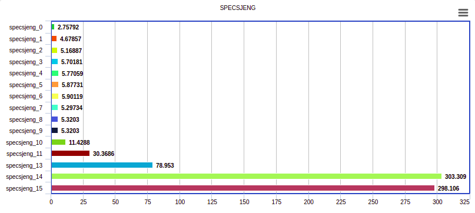
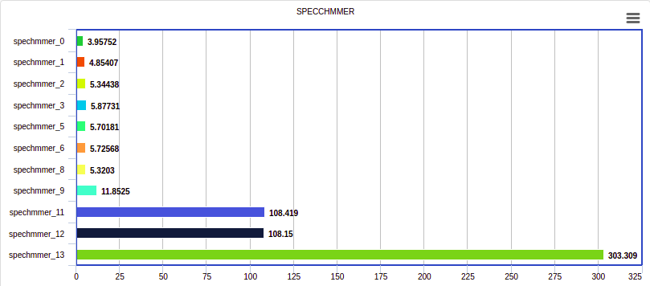
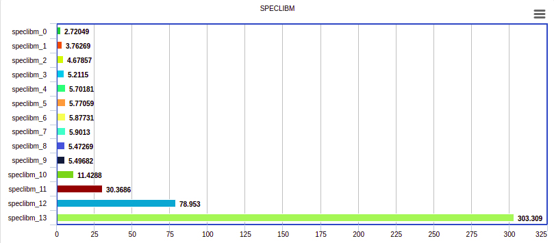
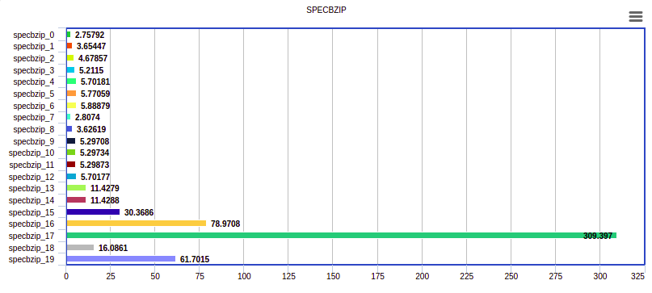
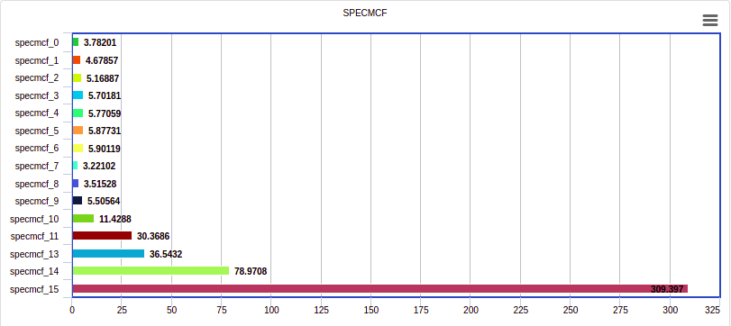

# Computer Architecture Lab 3

## Ομάδα 13
### Νένος Δημήτρης 9012 dimineno@ece.auth.gr
### Κουτζιαμπάσης Δημήτρης 8989 dkoutzia@ece.auth.gr

#### Βήμα 1
#### Ερώτημα 1
Η επικύρωση του McPAT στο αρχικό paper βασίζεται σε δημοσιευμένα δεδομένα για τους επεξεργαστές : **Niagara** ,  **Niagara2** , **Alpha 21364** , **Xeon Tulsa**,
συμπεριλαμβανομένου του ρυθμού ρολογιού στόχου, της θερμοκρασίας λειτουργίας και των αρχιτεκτονικών παραμέτρων.Ο στοχευόμενος χρόνος κύκλου ρολογιού χρησιμοποιείται ως το ανώτερο 
όριο για τον περιορισμό χρονισμού που χρησιμοποιείται στο McPAT για τον προσδιορισμό των βασικών ιδιοτήτων του κυκλώματος.

#### Ερώτημα 2

Στο συγκεκριμένο ερώτημα ζητείται να ανατρέξουμε στην βιβλιογραφία αναφορικά με τις απώλειες ισχύος σε ένα CMOS, έτσι ώστε να κατονοήσουμε καλύτερα τα αποτελέσματα του McPAT 
Simulator και πιο συγκεκριμένα, το **Dynamic Power** καθώς και το **Leakage** τα οποία δίνονται ως αποτελέσματα με το πέρας της κάθε προσομοίωσης. Αρχικά, οι συνολικές απώλειες 
ισχύος σε ένα CMOS είναι το άθροισμα της δυναμικής κατανάλωσης και της στατικής κατανάλωσης, δηλαδή, **P_total = P_dynamic + P_static**. Η δυναμική κατανάλωση με την σειρά της 
αποτελείτε από το άθροισμα των διακοπτικών απωλειών και το ρεύμα βραχυκυκλώματος, **P_dynamic = P_switcing + P_shortcircuit**. Ενώ οι στατικές απώλειες είναι αποτέλεσμα του 
**ρεύματος διαρροής υποκατωφίου** καθώς και του **ρεύματος διαρροής της πύλης**, δηλαδή δίνεται από τον τύπο **P_static = (I_sub + I_gate)\*Vdd** . Ας πάμε λοιπόν να αναλύσουμε 
πιο συγκεκριμένα όλες τις παραπάνω απώλειες ισχύος. 

* **Dynamic Power Dissipation**

  * **Switching\:**
Ονομάζεται και **ισχύς μεταγωγής** και oρίζεται ως η απώλεια ισχύος που οφείλεται στην στις απώλειες που δημιουργούνται κατά την έναυση και σβέση ενός MOSFET. Πιο 
συγκεκριμένα, δεδομένου ότι και η τάση και το ρεύμα δεν μεταβάλονται ακαριαία, δηλαδή υπάρχει μια μικρή καθυστέρηση λόγω της χωρητικής φύσης του MOSFET, κατά την διάρκεια της 
ένασυσης και της σβέσης ενός MOSFET δημιουργούνται κάποιες απώλειες ισχύος πάνω στο MOSFET και δίνονται από το γινόμενο V\*I. Η ισχύς μεταγωγής εξάρταται από την συχνότητα 
ρολογιού, την χωρητικότητα του CMOS σε συνδυασμό με την χωρητικότητα εξόδου, το τετράγωνο της τάσης τροφοδοσίας καθώς έναν παράγοντα δραστηριότητας (activity factor a). Δηλαδή, 
δίνεται από τον τύπο **P_switching = a\*C\*V^2\*f**

  * **Short Circuit\:**
     Οι απώλειες βραχυκυκλώματος οφείλονται στο γεγονός ότι όταν σε ένα CMOS μεταβάλεται η κατάσταση του, στιγμιαία άγουν ταυτόχρονα και το pull-up pMOS FET αλλά και το pull-down 
     nMOS FET. Κατα συνέπεια δημιουργείται στιγμιαία βραχυκύκλωμα μεταξύ γείωσης και τροφοδοσίας. Οι απώλειες αυτές είναι συνήθως περίπου το 10-20% της συνολικής δυναμικής  
     κατανάλωσης σύμφωνα με την βιβλιογραφία. 

* **Static Power Dissipation**

  * **Subthreshold Leakage Current\:**
     Οφείλεται στο ρεύμα που διαρρέεται κατα την διάρκεια της περιοχής αποκοπής του τρανζίστορ. Πιο συγκεκριμένα, κατα την διάρκεια αποκοποής του transistor υπάρχει ένα μικρό  
     leakage current που ρέει από το Drain στο Source ενός MOSFET.

  * **Gate Leakage Current\:**
     Οφείλεται στο ρεύμα που διαρρέται από την πύλη οξειδίου. Είναι επίσης σηματικό να αναφερθεί ότι το Gate Leakage είναι αρκετά μικρό και σχεδόν αμελητέο για τεχνολογίες άνω 
     των 65nm, αλλά για μεγέθη λιθογραφίας μικρότερα των 65nm το Gate Leakage γίνεται αισθητό και μάλιστα συγκρίσιμο με το Subthreshol Leakage.

Αρχικά, όπως είπαμε και προηγουμένως, οι απώλειες δυναμικής ισχύος είναι ανάλογες του συνολικού φορτίου χωρητικότητας, της τάσης τροφοδοσίας, της αλλαγής τάσης κατά την μεταγωγή, 
της συχνότητας του ρολογιού και ενός **παράγοντα δραστηριότητας (activity factor)** όπως αναφέρθηκε και παραπάνω. Ο παράγοντας αυτός οφείλεται στα στατιστικά των προσβάσεων τα 
οποία μας παρέχονται από την προσομοίωση της αρχιτεκτονικής.

Η διαρροή στατικής ισχύος εξαρτάται από το μέγεθος των τρανζίστορ και την τοπική κατάσταση των συσκεύων.

Άρα άμα εκτελέσω διαφορετικά προγράμματα πάνω στον ίδιο επεξεργαστή αυτό που θα επηρεαστεί θα είναι και οι **απώλειες δυναμικής ισχύος**, αφού είναι ανάλογες του **ativity 
factor** οποίος μεταβάλεται ανάλογα με το πρόγραμμα το οποίο τρέχει ο επεξεργαστής, δηλαδή είναι για παράδειγμα ανάλογες των προσβάσεων (accesses) στις caches και σε άλλα 
στοιχεία της αρχιτεκτονικής. Ταυτόχρονα, όταν τρέχουμε διαφορετικά προγράμματα επηρεάζονται και οι **απώλειες στατική ισχύς** αφού ανάλογα με το πρόγραμμα το οποίο τρέχει ο 
επεξεργαστής αλλάζει το **activity factor** και συνεπώς αλλάζει συνεχώς ο αριθμός των transistor που βρίσκονται σε αποκοπή. 

Τέλος, η χρονική διάρκεια εκτέλεσης ενός προγράμματος δεν έχει άμεσα σημασία στις ισχύς που δίνει το McPAT καθώς ο χρόνος εκτέλεσης ενός προγράμματος επηρεάζει την συνολική 
ενέργεια που εκλύεται σε θερμότητα, δηλαδή επηρεάζει την χρονική μεταβολή της ισχύος και όχι την στιγμιαία ισχύ που μας δίνει το McPAT.

#### Ερώτημα 3

Αρχικά, δίνεται ότι η στιγμιαία ισχύς που καταναλώνει ο **επεξεργαστής Α** είναι **25W**, ενω η στιγμιαία ισχύς του **επεξεργαστή Β** είναι **35W**,  δεδομένου ότι οι δύο 
επεξεργαστές τρέχουν το ίδιο πρόγραμμα και με την ίδια ταχύτητα (δηλαδή έχουν ίδια χρονική διάρκεια, memory accesses, committed instructions κλπ), τότε είναι φανερό ότι ο 
επεξεργαστής Β θα καταναλώνει **περισσότερη ενέργεια** από μια μπαταρία σε σχέση με τον επεξεργαστή Α. Στην περίπτωση όμως όπου ο επεξεργαστής Β ναι μεν τρέχει το ίδιο πρόγραμμα 
με τον Α αλλά είναι **αρκετά γρηγορότερος** , δηλαδή τρέχει το ίδιο πρόγραμμα σε **μικρότερη χρονική διάρκεια**, τότε η κατανάλωση ενέργειας από μια μπαταρία θα είναι μικρότερη 
για τον επεξεργαστή Β, καθώς η συνολική ενέργεια μιας μπαταρίας δίνεται από τις συνολικές **Whs (Watt-hours)** που μπορεί να τροφοδοτεί ένα σύστημα, δηλαδή είναι το γινόμενο 
**Watt\*Time**. Τέλος, εαν τα προγράμματα τα οποία τρέχουν οι δυο επεξεργαστές είναι διαφορετικά δεν μπορούμε να βγάλουμε κάποιο συμπέρασμα για την κατανάλωση ενέργειας από μια 
μπαταρία δεδομένου ότι λείπουν αρκετά δεδομένα τα οποία χρειαζόμαστε.

To McPAT δίνει ως αποτελέσματα κάποια ενεργειακά δεδομένα του εκάστοτε επεξεργαστή, συνεπώς όπως είπαμε και προηγουμένως, δεν μπορούμε να βγάλουμε κάποιο σίγουρο συμπέρασμα 
σχετικά με την διάρκεια της μπαταρίας του κάθε επεξεργαστικού συστήματος. Για να μπορέσουμε να βγάλουμε συμεράσματα όσον αφορά την διάρκεια της μπαταρίας, θα πρέπει να γνωρίζουμε 
περισσότερα πράγματα για το πρόγραμμα το οποίο τρέχει ο κάθε επεξεργαστής, με κυριότερη μεταβλητή τον **χρόνο εκτέλεσης** του κάθε προγράμματος.

#### Ερώτημα 4

Αρχικά, στον παρακάτω πίνακα φαίνονται τα συνοπτικά αποτελέσματα των δυο προσομοιώσεων.

|           |   Area     |   Peak Power   |   Total Leakage   |   Peak Dynamic   |   Subthreshold Leakage  | Subthreshold Leakage with Power Gating|    Gate Leakage   |   Runtime Dynamic    |
|-----------|------------|----------------|-------------------|------------------|-------------------------|------------------|----------------------|----------------|
|  Xeon     | 410.507mm^2| 134.938 W       | 36.8319 W          | 98.1063 W         | 35.1632 W                | 16.3977 W         |  1.66871 W        | 72.9199 W    |
|ARM A9 2GHz| 5.39698 mm^2| 1.74189 W       | 0.108687 W          | 1.6332 W         | 0.0523094 W             |      | 0.0563774 W        |  2.96053 W   |

Είναι εμφανές ότι ο επεξεργαστής Xeon έχει πολύ μεγαλύτερες ενεργειακές απαιτήσεις σε σχέση με τον ARM A9 , ένας από τους λόγους είναι και ότι ο Xeon έχει μεγαλύτερη συχνότητα 
ρολογιού , σύμφωνα με την προσομοίωση του **McPAT** στα **3.4 GHz** ενώ ο **ARM A9** στα **2GHz** και όπως αναφέρθηκε παραπάνω η δυναμική κατανάλωση ισχύος είναι ανάλογη της 
συχνότητας του ρολογιού. Φυσικά υπάρχουν και άλλοι λόγοι γι αυτό (πχ μέγεθος επεξεργαστή και επιμέρους στοιχείων της αρχιτεκτονικής). Στο ερώτημα που τέθηκε να απαντήσουμε, 
υποθέσαμε ότι ο Xeon έχει την δυνατότητα να τρέξει την ίδια εφαρμογή 40 φορές πιο γρήγορα από ότι ο ARM A9 και να δικαιολογήσουμε ότι παρόλα αυτά ο Xeon δεν μπορεί να είναι πιο 
energy efficient συγκριτικά με τον ARM A9. Ο απλούστατος λόγος για το οποίο ισχύει αυτό είναι ο Xeon έχει ενεργειακές απαίτησεις της τάξης του 40 και παραπάνω φόρες μεγαλύτερες
σε σχέση με τον ARM A9, όποτε ακομή και που ο ARM A9 θα εκτέλεσει το πρόγραμμα σε χρόνο 40 φορές μικρότερο, στο σύνολο θα καταναλώσει λιγότερη ενέργεια. Επίσης στο ερώτημα που 
μας τέθηκε ορίστηκε ότι και μετά την λήξη της εκτέλεσης της εφαρμογής οι επεξεργάστες δεν θα σταμάτησουν την λειτουργία τους, αλλα υποθετικά θα βρίσκονται σε κάποιο idle mode 
περιμένοντας εντολή για εκτέλεση της επομένης εφαρμογής. Βέβαια οι επεξεργαστές και σε idle mode θα καταναλώνουν ενέργεια, οπότε ο Xeon θα συνέχισει να έχει τις υψηλές 
ενεργειακές του απαιτήσεις και μετά την λήξη της λειτουγίας της εφαρμογής.

#### Βήμα 2
#### Ερώτημα 1
Όσο αναφορά το **Area** μπορούμε να το βρούμε από τα αποτελέσματα του mcpat, όπου απλά αθροίζουμε τις 2 τιμές  
που έχει η μεταβλητή Area , μία του core και μια του L2. Για το **delay** θεωρούμε ότι είναι κάτι ανάλογο του 
**runtime**.H **ενέργεια** που υπολογίζεται από το script **print_energy.py**, προκύπτει από τον τύπο **Ενέργεια 
= (Runtime Dynamic + Subthreshold leakage + Gate Lekage) * Runtime**.Η ενέργεια ανα μονάδα επιφάνειας EDAP 
βγαίνει με πολ/σμό * Αrea στον παραπάνω τύπο. 

#### Ερώτημα 2
Παρακάτω φαίνονται μερικά από τα αποτελέσματα των προσομοιώσεων που έγιναν στο GEM5 κατα την διάρκεια του προηγούμενου εργαστηρίου, τα οποία τώρα τα βάμαμε στο McPAT και βγάλαμε 
και μερικά συμπεράσματα όσον αφορά τις ενεργειακές επιπτώσεις που έχει η κάθε σχεδιαστική αλλαγή. Πιο συγκεκριμένα, στους συγκεκριμένους πίνακες φαίνονται τα χαρακτηριστικά της 
κάθε προσομοίωσης καθώς και τα απετελέσματα (CPI, Area, Energy) του εκάστοτε benchmark.  

##### SPECBZIP.

|               | l1d_size        | l1i_size       | l2_size        | l1i_assoc       | l1d_assoc       | l2_assoc     | cacheline_size  | cpi    | Area | Energy | 
| ------------- | -------------  | -------------  | -------------   | -------------   | -------------   | -------------   | -------------  | ------------- | -------- | -------|
|specbzip_0	 	 | 32kB       | 32kB       |512kB         | 1       | 1       | 2       | 64        |1.764253		        || 6.61289 mm^2 | 99.769714 mJ|
|specbzip_1	 	| 64kB       | 32kB      | 512kB          | 1       |  1       | 2       | 64        |1.725648		 || 9.24063 mm^2| 168.090393 mJ| 
|specbzip_2	 	| 64kB      | 64kB       |512kB        | 1        | 1      | 2       | 64        | 1.725587		| 11.62949 mm^2| 214.466570 mJ| 
|specbzip_3	 	| 64kB      | 128kB       |512kB       | 1        | 1       | 2      | 64        |1.725587		| 13.9581 mm^2| 246.914717 mJ| 
|specbzip_4	 	| 128kB     | 128kB       | 512kB         | 1        | 1       | 2       | 64        | 1.690684	|16.5196 mm^2| 284.129615 mJ| 
|specbzip_5	 	 | 128kB       | 128kB       | 1024kB       | 1       | 1       | 2       | 64        |1.657080	|18.60199 mm^2| 279.730684 mJ| 
|specbzip_6	 	 | 128kB       | 128kB       | 2048kB        | 1       | 2       | 2       | 64        |1.615417	|22.12171 mm^2|275.053492 mJ| 
|specbzip_7	 	 | 32kB      | 32kB       | 512kB        | 2        | 2       | 2       | 64        |1.741313	|6.68264 mm^2| 99.501349 mJ| 
|specbzip_8	 	 | 32kB      |32kB       | 512kB        | 4       | 4       | 2       | 64        |1.727934		| 8.28569 mm^2| 132.131456 mJ| 
|specbzip_9	 	 | 128kB     | 128kB      | 512kB         | 4       | 4       | 2       | 64        |1.672335	|18.9097 mm^2| 227.559831mJ| 
|specbzip_10 	 | 128kB       |128kB       | 512kB        |  4       | 4       | 4       | 64        |1.671640	|18.90841 mm^2| 227.484909 mJ| 
|specbzip_11	 | 128kB       | 128kB       | 512kB        | 4       | 4       | 8       | 64        |1.669988	|18.94645 mm^2| 227.321187 mJ| 
|specbzip_12	 | 128kB      | 128kB       | 512kB         |  1      |  1     |  1     | 64        |1.705180	|16.52052 mm^2| 286.185367 mJ| 
|specbzip_13	 | 128kB      | 128kB       | 512kB         |  1      |  1     |  1     | 128        |1.655485	|33.9632 mm^2| 277.150968 mJ|
|specbzip_14 	 | 128kB      |128kB       | 512kB        | 4       | 4       | 4       | 128        |1.653746	| 33.0362 mm^2| 276.973428 mJ| 
|specbzip_15 	 | 128kB     | 128kB      | 512kB         | 4       | 4       | 4       | 256        |1.661638	| 62.5001 mm^2| 544.048321 mJ| 
|specbzip_16 	 | 32kB       |32kB       | 512kB        |  1       | 1       | 2       | 512        |1.919129	| 96.9152 mm^2| 957.754973 mJ| 
|specbzip_17	 | 32kB       | 32kB       | 512kB        | 1       | 1       | 2       | 1024        |2.268345	| 387.69 mm^2| 4367.407525 mJ| 
|specbzip_18	 | 128kB      | 128kB       | 4MB         |  16      |  16     |  8     | 128        |1.570182	 | 45.406 mm^2| 410.440789 mJ| 
|specbzip_19	 | 128kB      | 128kB       | 4MB         |  16      |  16     |  8     | 256        |1.563098	 | 190.7295 mm^2| 1374.247262 mJ|

#### SPECHMMER

|               | l1d_size        | l1i_size       | l2_size        | l1i_assoc       | l1d_assoc       | l2_assoc     | cacheline_size  | cpi    | Area | Energy | 
| ------------- | -------------  | -------------  | -------------   | -------------   | -------------   | -------------   | -------------  | ------------- | --------- | ------|
|spechmmer_0 	 | 32kB       | 64kB       |2048kB         | 1       | 1       | 2       | 64      |6.997622	   |  14.60386 mm^2  | 0.085377 mJ| 
|spechmmer_1 	| 64kB       | 64kB      | 2048kB          | 1       |  1       | 2       | 64        |5.724630	 |    17.2316 mm^2 |  0.114887 mJ | 
|spechmmer_2 	| 128kB      | 64kB       |2048kB        | 1        | 1      | 2       | 64        | 6.915103	|    19.79311 mm^2 |   0.135710 mJ | 
|spechmmer_3 	| 128kB      | 128kB       |2048kB       | 1        | 1       | 2      | 64        | 6.893103	| 22.12171 mm^2|  0.155474 mJ| 
|spechmmer_4 	| 128kB     | 128kB       | 1024kB         | 1        | 1       | 2       | 64        | 6.893103	| 18.60199 mm^2|          mJ| 
|spechmmer_5 	 | 128kB       | 128kB       | 512kB       | 1       | 1       | 2       | 64        |6.893103	|16.5196 mm^2| 0.155176 mJ|
|spechmmer_6 	 | 128kB       | 128kB       | 512kB        | 2       | 2       | 2       | 64        |6.878964	|16.7739 mm^2| 0.153802 mJ| 
|spechmmer_7 	 | 128kB      | 128kB       | 512kB        | 4        | 4       | 4       | 64        |6.878964	|18.90841 mm^2 |       mJ| 
|spechmmer_8 	 | 128kB      |128kB       | 512kB        | 8       | 8       | 8       | 64        |6.878964	| 12.53355 mm^2 | 0.092903 mJ | 
|spechmmer_9 	 | 128kB     | 128kB      | 512kB         | 8       | 8       | 8       | 128        |5.573137	|  33.4902  mm^2 | 0.107397 mJ|
|spechmmer_11	 | 128kB       | 128kB       | 512kB        | 4       | 4       | 4       | 512        |4.628369	 |173.5881  mm^2  | 0.496481 mJ|
|spechmmer_12	 | 64kΒ      | 64kB       | 512kB         |  4      |  4     |  4     | 512        |4.669199	 |173.3951  mm^2  |0.493668 mJ|
|spechmmer_13	 | 32kΒ      | 64kB       | 512kB         |  1      |  1     |  2     | 1024        |5.724630	 |387.69    mm^2  |1.325203 mJ|

#### SPECLIBM.

|               | l1d_size        | l1i_size       | l2_size        | l1i_assoc       | l1d_assoc       | l2_assoc     | cacheline_size  | cpi    | Area | Energy 
| ------------- | -------------  | -------------  | -------------   | -------------   | -------------   | -------------   | -------------  | ------------- |  -------------  | ------------- |  
|speclibm_0 	 | 16kB       | 16kB       |512kB         | 1       | 1       | 2       | 64        |3.114930	| 6.5129 mm^2 |167.176252 mJ| 
|speclibm_1  	 | 16kB       | 64kB      | 512kB          | 1       |  1       | 2       | 64        |1.752845	 | 8.94937 mm^2| 252.462450 mJ|
|speclibm_2  	 | 64kB      | 64kB       |512kB        | 1        | 1      | 2       | 64        | 3.087360	|  11.62949 mm^2| 359.166136 mJ| 
|speclibm_3 	 | 64kB      | 128kB       |512kB       | 1        | 1       | 2      | 64        | 3.087360	|  13.9581 mm^2| 417.221075 mJ| 
|speclibm_4 	 | 128kB     | 128kB       | 512kB         | 1        | 1       | 2       | 64        |  3.082420	| 14.798063 mm^2| 484.655864 mJ| 
|speclibm_5 	 | 128kB       | 128kB       | 1024kB       | 1       | 1       | 2       | 64        |3.081454		| 18.60199 mm^2| 485.200725 mJ| 
|speclibm_6 	 | 128kB       | 128kB       | 2048kB        | 1       | 1       | 2       | 64        |3.079779	| 22.12171 mm^2| 485.960351 mJ| 
|speclibm_7 	 | 128kB      | 128kB       | 2048kB        | 2        | 2       | 4       | 64        |3.075328	| 22.37101 mm^2 | 488.008252 mJ| 
|speclibm_8 	 | 128kB      |128kB       | 2048kB        | 4       | 4       | 4       | 64        |3.075328		| 24.50681 mm^2 |384.673960 mJ| 
|speclibm_9 	 | 128kB     | 128kB      | 2048kB         | 8       | 4       | 8       | 64        |3.075328	| 17.4118 mm^2 | 343.319116 mJ| 
|speclibm_10 	 | 128kB       |128kB       | 2048kB        |  8       | 8       | 8       | 128        |2.283224	| 55.9284 mm^2| 2.50694184 mJ| 
|speclibm_11     | 128kB       | 128kB       | 2048kB        | 8       | 8       | 8       | 256        |1.809287	| 120.8017 mm^2|  346.552943 mJ| 
|speclibm_12     | 64kΒ      | 64kB       | 1024kB         |  8      |  8     |  8     | 256        |1.752845	| 97.5003 mm^2| 835.452376 mJ| 
|speclibm_13     | 128kB       | 128kB       | 4ΜΒ        | 4       | 4       | 4       | 2048        | 1.654755 | 2555.06 mm^2 | 3375.070711 mJ | 

#### SPECMCF.

|               | l1d_size        | l1i_size       | l2_size        | l1i_assoc       | l1d_assoc       | l2_assoc     | cacheline_size  | cpi    | Area | Energy |
| ------------- | -------------  | -------------  | -------------   | -------------   | -------------   | -------------   | -------------  | ------------- | -------------  | ------------- | 
|specmcf_0	 	 | 32kB       | 64kB       |512kB         | 1       | 1       | 2       | 64        | 1.248496	   | 9.00175 mm^2| 106.597996 mJ| 
|specmcf_1	 	 | 64kB       | 64kB      | 512kB          | 1       |  1       | 2       | 64        | 1.841442	 | 11.62949 mm^2| 152.525379 mJ| 
|specmcf_2	 	 | 128kB      | 64kB       |512kB        | 1        | 1      | 2       | 64        | 1.208460	| 14.191 mm^2| 182.119338 mJ| 
|specmcf_3	 	 | 128kB      | 128kB       |512kB       | 1        | 1       | 2      | 64        | 1.208222	| 16.5196 mm^2|204.862513 mJ|
|specmcf_4	 	 | 128kB     | 128kB       | 1024kB         | 1        | 1       | 2       | 64        | 1.203915	| 18.60199 mm^2| 204.517974 mJ| 
|specmcf_5	 	 | 128kB       | 128kB       | 2048kB       | 1       | 1       | 2       | 64        | 1.199678	| 22.12171 mm^2|204.306119 mJ| 
|specmcf_6	 	 | 128kB       | 128kB       | 2048kB        | 2       | 2       | 2       | 64        | 1.126087	| 22.37601 mm^2|194.043530 mJ| 
|specmcf_7	 	 | 32kB      | 32kB       | 512kB        | 4        | 4       | 4       | 64        | 1.167262	| 18.90841 mm^2| 86.968656 mJ| 
|specmcf_8	 	 | 32kB      |32kB       | 512kB        | 8       | 8       | 8       | 64        | 1.166788	| 12.53355 mm^2| 98.752687 mJ| 
|specmcf_9	 	 | 128kB     | 128kB      | 512kB         | 8       | 8       | 8       | 64        | 1.133901	| 12.53355 mm^2| 168.581348 mJ| 
|specmcf_10 	 | 128kB       |128kB       | 512kB        |  4       | 4       | 4       | 128        | 1.111803	| 33.0362 mm^2| 186.854431 mJ|
|specmcf_11	   | 128kB       | 128kB       | 512kB        | 4       | 4       | 4       | 256        | 1.103812	| 62.5001 mm^2| 362.294869 mJ| 
|specmcf_12	   | 128kB      | 128kB       | 512kB         | 8      |  8     |  8     | 256        |   NAN	| 83.097 mm^2|         mJ| 
|specmcf_13 	 | 64kB      | 64kB       | 256kB         |  8      |  8     |  8     | 256        | 1.114758	| 74.4836 mm^2| 531.518825 mJ| 
|specmcf_14 	 | 32kB      |32kB       | 512kB        | 1       | 1       | 2       | 512        | 1.841442	| 109.6617 mm^2| 917.216470 mJ| 
|specmcf_15 	 | 32kB     | 32kB      | 512kB         | 1       | 1       | 2       | 1024        | 2.247934	| 387.69 mm^2| 4108.719113 mJ|

#### SPECSJENG

|               | l1d_size        | l1i_size       | l2_size        | l1i_assoc       | l1d_assoc       | l2_assoc     | cacheline_size  | cpi    | Area | Energy | 
| ------------- | -------------  | -------------  | -------------   | -------------   | -------------   | -------------   | -------------  | ------------- | -------- | -------|
|specsjeng_0	 | 32kB       | 64kB       |512kB         | 1       | 1       | 2       | 64        |8.731224        | 6.61289 mm^2 | 470.686321 mJ| 
|specsjeng_1	| 64kB       | 64kB      | 512kB          | 1       |  1       | 2       | 64        |3.446290	 | 11.62949 mm^2| 985.581333 mJ| 
|specsjeng_2	| 128kB      | 64kB       |512kB        | 1        | 1      | 2       | 64        | 8.729778	| 14.191 mm^2 | 1170.466177 mJ| 
|specsjeng_3	| 128kB      | 128kB       | 512kB       | 1        | 1       | 2      | 64        | 8.730028	| 16.5196 mm^2| 1334.652240 mJ| 
|specsjeng_4	| 128kB     | 128kB       | 1024kB         | 1        | 1       | 2       | 64        | 8.729588	| 18.60199 mm^2 | 1336.766349 mJ| 
|specsjeng_5	 | 128kB       | 128kB       | 2048kB       | 1       | 1       | 2       | 64        |8.728178	 | 22.12171 mm^2 | 1339.778703 mJ| 
|specsjeng_6	 | 128kB       | 128kB       | 2048kB        | 2       | 2       | 2       | 64        |8.727299	| 22.37601 mm^2 | 1342.153541 mJ| 
|specsjeng_7	 | 128kB      | 128kB       | 512kB        | 4        | 4       | 4       | 64        |8.730076	| 24.50681 mm^2 | 1045.041391 mJ | 
|specsjeng_8	 | 128kB      |128kB       | 512kB        | 8       | 8       | 8       | 64        |8.729650	 | 17.4118 mm^2 |  839.519243 mJ | 
|specsjeng_9	 | 128kB     | 128kB      | 512kB         | 8       | 8       | 8       | 64        | 8.729650	| 55.9284 mm^2 |  839.519243 mJ | 
|specsjeng_10	 | 128kB       |128kB       | 512kB        |  4       | 4       | 4       | 128        |5.993796	 | 14.66317 mm^2 |839.020884 mJ | 
|specsjeng_11	 | 128kB       | 128kB       | 512kB        | 4       | 4       | 4       | 256        |4.439235	 | 20.13885 mm^2 |1331.145517 mJ| 
|specsjeng_12	 | 32kB      | 64kB       | 512kB         |  1      |  1     |  2     | 512        |3.446290	 | 109.6617 mm^2 |1588.670618 mJ| 
|specsjeng_13	 | 32kB      | 64kB       | 512kB         |  1      |  1     |  2     | 1024        |3.021039 | 387.69 mm^2 | 5568.468909 mJ| 

Στην συνέχεια παρουσιάζονται τα γραφήματα των εκάστοτε benchmark τα οποία δείχνουν τις επιδράσεις που είχαν οι αλλαγές των παραμέτρων του συστήματος στις απώλειες ισχύος του.

#### SPECSJENG

#### SPECHMMER

#### SPECLIBM.

#### SPECBZIP.

#### SPECMCF.

#### Ερώτημα 3

Σύμφωνα με τα αποτελέσματα της συνάρτησης κόστους της προηγούμενης άσκησης είναι ξεκάθαρο το θετικό impact που έχει το cache line size 
στα περισσοτερα benchmarks , εφόσον χωρίς να προσθέτει κάποιο κόστος υλοποίησης ρίχνει δραματικά το CPI . Επίσης παρατηρούμε από το 
διάγραμμα ότι η αύξηση των μεγεθών της L2 και L1 caches δεν μείωνουν ικανοποιητικά το 
CPI σε όλα τα benchmarks. Οπότε ως βέλτιστες λύσεις στα περισσότερα benchmarks θα προτιμούσαμε τα συστήματα με χαμηλό μέγεθος cache size/
associativities οσο το δυνατόν περισσότερο και μεγάλο μέγεθος cache line size.

Από την άλλη πλευρά η μεγαλύτερη επιρροή στο τελικό peak power έχει το μέγεθος γραμμής της cache,τη μικρότερη επιρροή όλων έχει το 
associativity στις L1 και L2 caches καθώς και το μέγεθος της L2 cache. Το μέγεθος της L2 δεν επηρεάζει την κατανάλωση στον ίδιο βαθμό με αυτόν της L1 λόγω του ότι η L2, αν και 
μεγαλύτερη που θα συνεπαγόταν περισσότερο χρόνο (άρα και ενέργεια) για lookups σε περίπτωση που της ζητηθεί κάτι, δεν παύει να είναι η cache η οποία ενεργοποιείται όταν η L1 
έχει miss, και για μικρά L1 miss rates η L2 δεν έχει μεγάλο αριθμό αιτήσεων. Με άλλα λόγια, μακροχρόνια η L2 ακόμα κι αν είναι λόγω μεγέθους πιο ενεργοβόρα ανά lookup από την 
L1, δεν δέχεται τον ίδιο αριθμό αιτήσεων, με αποτέλεσμα το ενεργειακό κόστος να "επιμερίζεται" στο μεγαλύτερο χρονικό διάστημα.

Το  συμπέρασμα που βγάλαμε είναι ότι άυξηση του cache line size  μπορεί μειώνει CPI αλλά καταναλώνει περισσότερη ενέργεια το σύστημά μας.

### Βιβλιογραφία

1. [McPAT: An Integrated Power, Area, and Timing Modeling Framework for Multicore and Manycore Architectures](https://www.hpl.hp.com/research/mcpat/micro09.pdf)
3. [Full-System Simulation of big.LITTLE Multicore Architecture for Performance and Energy Exploration](https://ieeexplore.ieee.org/document/7774439)
4. [Power models for multicore processor simulators with multiple levels of abstraction](https://upcommons.upc.edu/bitstream/handle/2117/77219/108862.pdf?sequence=1&isAllowed=y)
5

### Κριτική Εργασίας

Όπως και οι προηγούμενες, έτσι και αυτή η εργασία ήταν αρκετά ενδιαφέρουσα και εκπαιδευτική. Ένας από τους λόγους ήταν ότι είδαμε ότι σαν Αρχιτέκτονες πρέπει να κάνουμε κάποια 
trade-offs στις σχεδιαστικές μας λύσεις, καθώς η βελτίωση ενός παράγοντα, μπορεί να έχει επιτώσεις σε κάποια άλλη σχεδιαστική παράμετρο. Τέλος, οφείλουμε να αναφέρουμε ότι, με 
το πέρας των τριών αυτών εργαστηρίων έχουμε αποκτήσει πλέον κάποιες αρκετά βασικές γνώσεις της αρχιτεκτονικής ενός επεξεργαστή αλλά είχαμε και την δυνατότητα να πειραματιστούμε 
με διάφορα λογισμικά, όπως το gem5 και το McPAT, κάνοντας έτσι την μαθησιακή διαδικασία αρκετά ενδιαφέρουσα!

